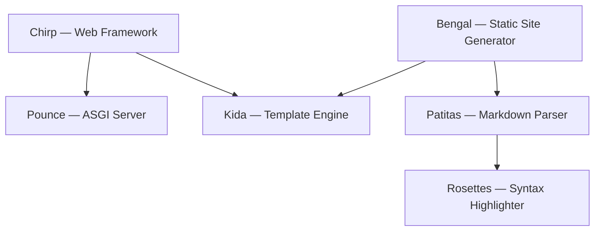
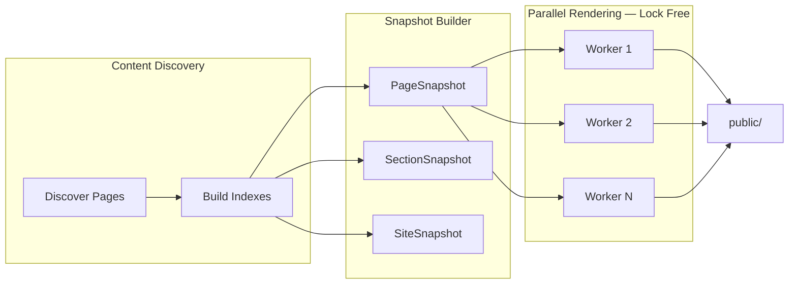
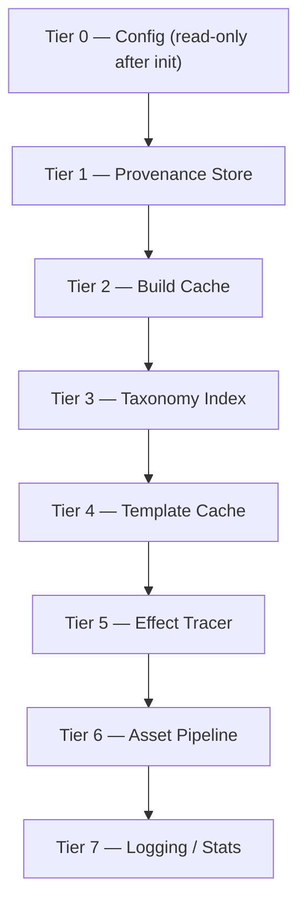
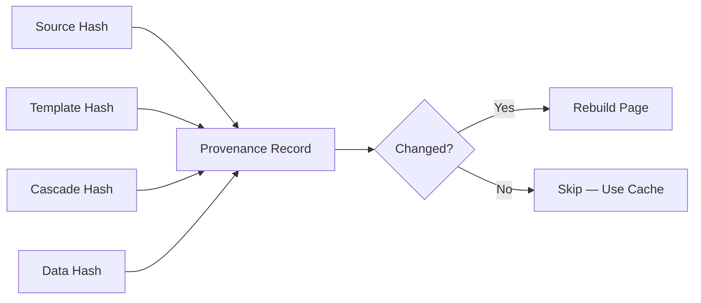

# Bengal SSG — Built for Python's Free-Threaded Future

I built Bengal because I wanted a static site generator that could actually use all my cores. Python SSGs have a reputation: fast enough for small sites, but when you scale past a few hundred pages, build times crawl. The usual culprit is the GIL — Python's Global Interpreter Lock means threads don't give you real parallelism for CPU-bound work like rendering Markdown or compiling templates.

Bengal takes a different path. It's designed from the ground up for **free-threaded Python** (PEP 703), and it's the top layer in a stack of six libraries — all pure Python, all targeting 3.14t — that this series will walk through.



Every library in this diagram is free-threading-ready. Every one declares `_Py_mod_gil = 0`. And this blog — the one you're reading — is built and served by this stack.

---

## The series

:::{tip} About this series
This is **Part 1 of 6** in *Free-Threading in the Bengal Ecosystem*. Each post covers one library, the threading patterns it uses, and benchmark data comparing GIL vs free-threaded performance.

- **Part 1: Bengal** — Parallel rendering, immutable snapshots, provenance *(you are here)*
- [Part 2: Kida](/blog/posts/kida-free-threading-template-engine/) — Copy-on-write, immutable AST, ContextVar
- [Part 3: Patitas](/blog/posts/patitas-free-threading-markdown-parser/) — Parallel parsing, O(n) lexer, structural diff
- [Part 4: Rosettes](/blog/posts/rosettes-free-threading-syntax-highlighter/) — Local-only state machines, frozenset lookups
- [Part 5: Pounce](/blog/posts/pounce-free-threading-asgi-server/) — Thread-based ASGI workers, shared immutable config
- [Part 6: Chirp](/blog/posts/chirp-free-threading-web-framework/) — Double-check freeze, ContextVar request isolation
:::

---

## Run it with free-threaded Python

```bash
uv python install 3.14t
uv run --python=3.14t bengal build
```

Bengal detects free-threading at runtime and uses `ThreadPoolExecutor` when available. Same code paths either way — you get real parallelism when the GIL is disabled.

---

## Performance

Here's what parallel rendering looks like on real sites. These numbers come from Bengal's benchmark suite (`tests/performance/`) running on a 1,000-page test site.

:::{list-table} Parallel build scaling (1,000 pages)
:header-rows: 1

* - Workers
  - Time
  - Speedup
* - 1
  - ~9.0 s
  - 1.0x
* - 2
  - ~5.0 s
  - 1.8x
* - 4
  - ~3.0 s
  - 3.0x
* - 8
  - ~2.5 s
  - 3.6x
:::

:::{list-table} GIL vs free-threaded (1,000 pages, 4 workers)
:header-rows: 1

* - Build
  - Time
  - Notes
* - Python 3.14 (GIL enabled)
  - ~3.5 s
  - Threads serialized
* - Python 3.14t (PYTHON_GIL=0)
  - ~2.0 s
  - 1.75x speedup, real parallelism
:::

Incremental builds are where it gets dramatic: single-page changes rebuild in 35–80 ms. That's provenance-based invalidation, not thread count — but the architecture that enables fast incremental builds is the same one that enables safe parallelism.

---

## Detecting free-threaded Python at runtime

Bengal doesn't assume free-threading — it detects it:

```python
def is_free_threaded() -> bool:
    if hasattr(sys, "_is_gil_enabled"):
        try:
            return not sys._is_gil_enabled()
        except (AttributeError, TypeError):
            pass
    try:
        import sysconfig
        return sysconfig.get_config_var("Py_GIL_DISABLED") == 1
    except (ImportError, AttributeError):
        pass
    return False
```

When this returns `True`, Bengal spins up a `ThreadPoolExecutor` for page rendering. Each worker thread gets its own rendering pipeline (stored in `threading.local()`), so there's no contention on the hot path.

:::{tip} Pattern
`sys._is_gil_enabled()` is the authoritative runtime check. The `sysconfig` fallback handles builds configured with `--disable-gil` where the runtime API might not yet be available.
:::

---

## Immutable snapshots for lock-free rendering

The trick to parallel rendering isn't spawning threads. It's avoiding locks in the hot path.

After content discovery, Bengal freezes the entire site into immutable dataclasses — `PageSnapshot`, `SectionSnapshot`, `SiteSnapshot`. All navigation trees, taxonomy indexes, and page metadata are pre-computed. During rendering, workers only read from these snapshots.

```python
@dataclass(frozen=True, slots=True)
class PageSnapshot:
    title: str
    href: str
    source_path: Path
    parsed_html: str
    content_hash: str
    section: SectionSnapshot | None = None
    next_page: PageSnapshot | None = None
    prev_page: PageSnapshot | None = None
```



This eliminated an entire tier of locks. Previously, `NavTreeCache` and `Renderer._cache_lock` were acquired during parallel rendering. Now, `SiteSnapshot.nav_trees` and `SiteSnapshot.top_level_*` are pre-computed in the snapshot builder. The rendering phase is lock-free.

:::{warning} Gotcha
Frozen dataclasses with `slots=True` are critical — not just `frozen=True`. Without `__slots__`, Python still allocates a `__dict__` per instance, which means higher memory overhead and no protection against accidental attribute assignment.
:::

---

## Context propagation into worker threads

`ThreadPoolExecutor.submit()` does not inherit the calling thread's `ContextVar` values. If your template filters or logging use `ContextVar`s, they'll be empty in worker threads unless you propagate them.

Bengal uses `contextvars.copy_context().run` as the callable passed to `submit`:

```python
ctx = contextvars.copy_context()
future_to_page = {
    executor.submit(ctx.run, process_page_with_pipeline, page): page
    for page in batch
}
```

:::{tip} Pattern
`executor.submit(ctx.run, fn, arg)` runs `fn(arg)` inside a copy of the parent's context. The copy includes all `ContextVar` values from the moment `copy_context()` was called. This is the standard pattern for ContextVar propagation into thread pools.
:::

---

## Thread-local vs ContextVar — when to use which

Bengal uses two concurrency primitives deliberately:

:::{tab-set}
:::{tab-item} threading.local()
**For per-worker state**: rendering pipelines, parsers. Each `ThreadPoolExecutor` worker gets its own instance. Correct for "one pipeline per thread."

```python
_thread_local = threading.local()

def get_pipeline() -> RenderPipeline:
    if not hasattr(_thread_local, "pipeline"):
        _thread_local.pipeline = RenderPipeline()
    return _thread_local.pipeline
```
:::
:::{tab-item} ContextVar
**For per-task context**: asset manifests, resolution stats, render context. Propagates across `contextvars.copy_context().run()`. Correct for "context that should follow the task."

```python
_manifest: ContextVar[AssetManifest] = ContextVar("manifest")

def get_manifest() -> AssetManifest:
    return _manifest.get()
```
:::
:::

Don't mix them. `ContextVar` is for "context that propagates with the task." `threading.local()` is for "one instance per worker thread."

---

## Lock ordering when locks are unavoidable

Some state *does* need locks — caches, provenance stores, taxonomy indexes. Bengal documents a global lock ordering (Tier 0 through Tier 7) in `bengal/concurrency.py` that every developer must follow:



Acquire locks in ascending tier order. Never hold a higher-tier lock while acquiring a lower-tier one. That discipline prevents deadlocks under free-threading.

:::{tip} Pattern
Document your lock ordering. It's verbose, but it makes the threading model auditable. Bengal's `concurrency.py` maintains a full inventory — which lock protects what, and in which tier.
:::

---

## Provenance over manual dependencies

Incremental builds are where many SSGs get messy. "Which pages depend on this template? Which taxonomy keys does this page invalidate?" — usually answered by a patchwork of detectors.

Bengal uses **content-addressed provenance** instead. Each rendered output is hashed with everything that influenced it: source files, templates, cascade data, taxonomy keys. When a file changes, Bengal recomputes provenance and filters — only outputs whose provenance changed need rebuilding.



No manual dependency graph. The previous system used ~13 separate dependency detectors. Provenance collapsed them into one model and made incremental builds practical for large sites.

---

## Effect tracing — one model to replace thirteen detectors

Even with provenance, you need to *record* what each render depends on and invalidates. Bengal's `EffectTracer` does that with a single unified model:

```python
class EffectTracer:
    def __init__(self) -> None:
        self._effects: list[Effect] = []
        self._lock = threading.Lock()
        self._dep_index: dict[Path | str, list[Effect]] = defaultdict(list)
        self._output_index: dict[Path, Effect] = {}
```

During rendering, effects are recorded — source files, layouts, includes, parent `_index.md`, data files. When files change, `tracer.invalidated_by(changed_files)` returns the precise set of outputs to rebuild. Thread-safe, because it only reads from the frozen `SiteSnapshot`.

---

## What this means in practice

On free-threaded Python 3.14t with `PYTHON_GIL=0`, Bengal renders hundreds of pages in parallel without GIL contention. On standard Python, the same architecture runs — you just get sequential rendering until you switch interpreters.

The bigger win might be incremental builds. Provenance + effect tracing means rebuilds are fast and correct. Change one file, rebuild only what's affected — no stale cache, no over-invalidation. 35–80 ms for a single-page change on an 800-page site.

---

## Further reading

- [Python experimental support for free threading](https://docs.python.org/3/howto/free-threading-python.html)
- [Bengal documentation](https://lbliii.github.io/bengal/)
- [Bengal source](https://github.com/lbliii/bengal)
- **Next in series:** [Kida — A Template Engine Built for Free-Threaded Python](/blog/posts/kida-free-threading-template-engine/)
