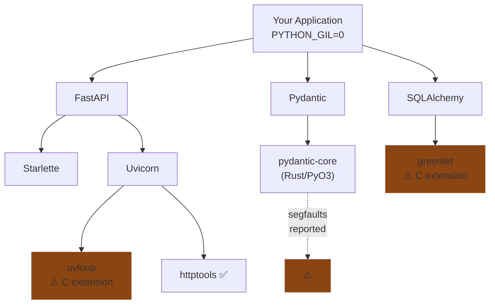

# Building for a World That Doesn't Exist Yet

It's March 2026. Free-threaded Python has been available since October 2024 when Python 3.13 shipped the first experimental `nogil` build. Python 3.14, released October 2025, made free-threading officially supported via PEP 779. That's seventeen months of availability. Five months of official support.

Try building a real application on it. I dare you.

---

## The silent kill switch

Here's the thing nobody talks about enough: **one import can silently re-enable the GIL for your entire process.**

When you import a C or Rust extension that hasn't declared free-threading support, Python doesn't crash. It doesn't raise an exception. It prints a `RuntimeWarning` — which most logging configs swallow — and quietly turns the GIL back on. Your `PYTHON_GIL=0` flag? Overridden. Your free-threaded architecture? Running single-threaded. Your benchmarks? Measuring the GIL.

```python
import sys
print(sys._is_gil_enabled())  # False — GIL is off, good

import some_c_extension       # RuntimeWarning: ... re-enabled the GIL

print(sys._is_gil_enabled())  # True — GIL is back, silently
```

This isn't hypothetical. It's happening right now with libraries you probably depend on.

---

## The graveyard of imports

The [free-threaded wheels tracker](https://hugovk.github.io/free-threaded-wheels/) monitors the top 360 most-downloaded PyPI packages with extensions. As of March 2026, roughly 13% of them will re-enable the GIL on import. That sounds small until you realize what's in that 13%.

Here's a partial list of libraries that either lack free-threaded wheels, haven't declared `Py_mod_gil`, or are still actively being ported:

:::{list-table} Libraries still not free-threading ready (March 2026)
:header-rows: 1

* - Library
  - What it does
  - Why it matters
  - Status
* - **lxml**
  - XML/HTML parsing
  - Used by scrapers, SOAP clients, document processing
  - 181-commit PR still open — not merged
* - **grpcio**
  - gRPC client/server
  - Every microservice calling gRPC
  - No free-threaded support
* - **OpenCV**
  - Computer vision
  - Image processing, ML pipelines
  - No free-threaded support
* - **polars**
  - DataFrames (Rust)
  - The "fast pandas" replacement
  - No free-threaded wheels
* - **tree-sitter**
  - Incremental parsing
  - Syntax highlighting, code analysis, editor tooling
  - Re-enables GIL; open issue #111
* - **tornado**
  - Async networking
  - Jupyter's transport layer
  - No free-threaded support
* - **spaCy**
  - NLP
  - Text processing, entity recognition
  - Waiting on blis, srsly, cymem chain
* - **vLLM**
  - LLM serving
  - High-throughput inference
  - No free-threaded support
* - **tokenizers**
  - HuggingFace tokenization (Rust)
  - Every transformer pipeline
  - No free-threaded wheels listed
* - **statsmodels**
  - Statistical models
  - Time series, regression, hypothesis testing
  - No free-threaded support
:::

And it cascades. spaCy can't be free-threading ready until `blis`, `srsly`, `cymem`, `preshed`, and `murmurhash` are all ready — a chain of five C extensions that all need to declare `Py_MOD_GIL_NOT_USED`. Miss one and the whole stack drops back to the GIL.

:::{warning}
Even libraries with free-threaded wheels aren't necessarily safe. Pydantic-core publishes `cp313t`/`cp314t` wheels but has reported segfaults on certain builds. "Has wheels" and "works correctly under contention" are very different bars.
:::

---

## The dependency chain problem

The real issue isn't individual libraries. It's that your dependency tree is only as free-threaded as its weakest link.



You set `PYTHON_GIL=0`. You import FastAPI. Somewhere deep in the dependency tree, one C extension without the right module slot fires, and you're back to GIL-protected execution. You won't know unless you explicitly check `sys._is_gil_enabled()` after every import.

---

## What the ecosystem is actually doing

Credit where it's due. The foundation work is real:

:::{list-table} What's actually ready (March 2026)
:header-rows: 1

* - Layer
  - Ready
  - Notes
* - **Build tools**
  - Cython 3.1, PyO3 0.23+, pybind11 2.13+, nanobind 2.2+
  - You can *build* free-threaded extensions
* - **Scientific core**
  - NumPy 2.1, SciPy 1.15, pandas 2.2.3
  - Core math works; edge cases remain
* - **ML frameworks**
  - PyTorch 2.6, JAX 0.5.1
  - Training and inference mostly work
* - **Serialization**
  - msgspec 0.20, msgpack 1.1.2
  - Fast and thread-safe
* - **Crypto**
  - cryptography 46.0, bcrypt 4.3, PyNaCl 1.6
  - Security stack is solid
:::

But notice what's missing from this list: **the application layer**. No web framework. No template engine. No ASGI server. No ORM rethinking its connection pool for thread contention.

The infrastructure is being retrofitted from the bottom up. Nobody is building from the application layer down.

---

## What "designed for" actually means

It's not enough for a library to "work" on free-threaded Python. Passing tests without segfaults is the floor, not the ceiling. **Designed for** free-threading means the architecture assumes threads share memory and the GIL doesn't exist:

:::{tab-set}
:::{tab-item} Retrofitted (typical)
```python
# Flask-style: thread-local global, patched later
from threading import local
_request_ctx = local()

def get_request():
    return _request_ctx.request  # silently wrong in threadpool
```
:::
:::{tab-item} Designed for free-threading
```python
# Chirp-style: ContextVar from day one
from contextvars import ContextVar
_request: ContextVar[Request] = ContextVar("request")

def get_request() -> Request:
    return _request.get()  # propagates into threadpool via copy_context()
```
:::
:::

:::{tab-set}
:::{tab-item} Retrofitted (typical)
```python
# Uvicorn-style: fork N processes, each has its own memory
# No shared state, but N copies of your app in RAM
workers = int(os.getenv("WEB_CONCURRENCY", 4))
for _ in range(workers):
    pid = os.fork()
```
:::
:::{tab-item} Designed for free-threading
```python
# Pounce-style: N threads, one shared immutable app
# Same memory, real parallelism, zero IPC
for _ in range(workers):
    thread = threading.Thread(target=worker_loop, args=(app, config))
    thread.start()
```
:::
:::

:::{tab-set}
:::{tab-item} Retrofitted (typical)
```python
# Jinja2: mutable Environment, not designed for concurrent render
env = Environment(loader=loader)
env.globals["foo"] = bar  # mutation at any time — unsafe under contention
```
:::
:::{tab-item} Designed for free-threading
```python
# Kida: compile to immutable AST, render state in ContextVar
env = Environment(loader=loader)
# AST is frozen after compilation — shared safely across threads
# Per-render state lives in ContextVar, never touches shared memory
```
:::
:::

Django can't switch from `threading.local()` to `ContextVar` without breaking every middleware that depends on `django.utils.functional.SimpleLazyObject`. Flask can't freeze its request object without breaking every extension that mutates `g`. Uvicorn can't switch from processes to threads without rethinking its entire supervisor model.

The b-stack doesn't carry that baggage. Every library was written knowing the GIL would go away.

---

## Why not wait?

Because the decisions that matter are architectural, and architecture is hardest to change after the fact.

If you wait for free-threading to be "ready" — meaning every library works, every edge case is handled, every tool has been updated — you'll build on the same patterns everyone else builds on. The frameworks that emerge will be retrofits of Django and Flask with `ContextVar` patches and "thread-safe mode" flags.

The opportunity right now is to build something that's *native* to the free-threaded world. Not "works with `nogil`" but "designed for it." The difference is the same as building a mobile app vs making a desktop app responsive. Technically equivalent. Architecturally different.

:::{warning}
Being early is painful. Things break in ways that have no Stack Overflow answers. CPython itself has bugs you'll be the first to report. The single-threaded overhead penalty is real. This is not the right choice for a production system that needs to work today with the broadest possible library compatibility.
:::

---

## The bet

The b-stack is a bet that free-threaded Python will become the default within 2-3 years. PEP 779 Phase II is underway. The core team is committed. NumPy, PyTorch, and Cython are already there. The trajectory is clear even if the timeline isn't.

When that transition happens, most of the Python web ecosystem will need to retrofit. Thread safety will be patched in. Shared mutable state will be wrapped in locks. `threading.local()` will be migrated to `ContextVar`. It'll work, but it'll carry the scars of being designed for a different world.

The b-stack — Kida, Patitas, Rosettes, Pounce, Chirp, Bengal — declares `_Py_mod_gil = 0` in every module. Zero C extensions. Zero Rust bindings. Pure Python, designed for a world where threads are real and the GIL is gone.

No import in this stack will silently re-enable the GIL. That's not a feature. It's the whole point.

---

## Further reading

- [Python experimental support for free threading](https://docs.python.org/3/howto/free-threading-python.html)
- [PEP 779 — Criteria for supported status for free-threaded Python](https://peps.python.org/pep-0779/)
- [Free-threading ecosystem tracker](https://py-free-threading.github.io/tracking/)
- [Free-threaded wheels tracker](https://hugovk.github.io/free-threaded-wheels/)
- [Part 1: Bengal — Free-Threading Architecture](/blog/posts/bengal-free-threading-architecture/)
- [The Vertical Stack Thesis](/blog/posts/the-vertical-stack-thesis/)
