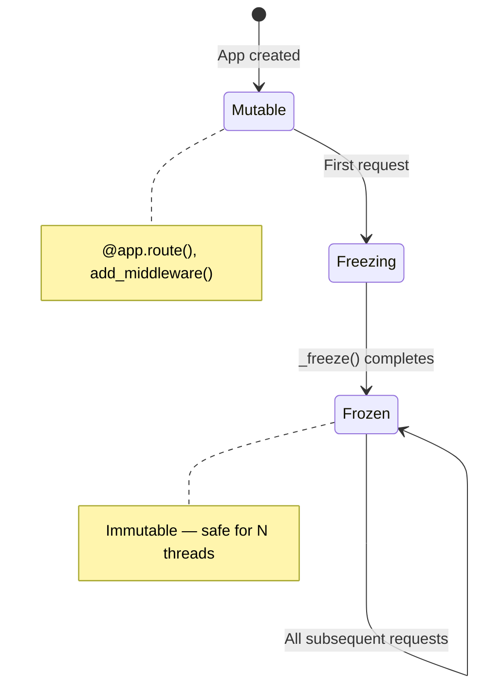

# Chirp — A Web Framework Built for Free-Threaded Python

This is the layer where users actually write code. Everything else in the Bengal stack — [Kida](/blog/posts/kida-free-threading-template-engine/) templates, [Patitas](/blog/posts/patitas-free-threading-markdown-parser/) parsing, [Rosettes](/blog/posts/rosettes-free-threading-syntax-highlighter/) highlighting, [Pounce](/blog/posts/pounce-free-threading-asgi-server/) serving — runs underneath. Chirp is the web framework that ties them together, and it's where the threading model has to be invisible to the app developer.

A web framework coordinates a lot of shared state: routes, middleware, template filters, session storage, request context. Under free-threaded Python, multiple worker threads hit the same app instance concurrently. If the app mutates shared dicts during setup, or if request-scoped data leaks across threads, you get races. The framework must either isolate state per request or protect shared state with locks — and the developer shouldn't have to think about which.

---

:::{tip} Series context
This is **Part 6 of 6** in *Free-Threading in the Bengal Ecosystem*. This post covers the user-facing layer — what it's like to build apps on a free-threading-ready stack.

- [Part 1: Bengal](/blog/posts/bengal-free-threading-architecture/) — Parallel rendering, immutable snapshots
- [Part 2: Kida](/blog/posts/kida-free-threading-template-engine/) — Copy-on-write, immutable AST
- [Part 3: Patitas](/blog/posts/patitas-free-threading-markdown-parser/) — Parallel parsing, O(n) lexer
- [Part 4: Rosettes](/blog/posts/rosettes-free-threading-syntax-highlighter/) — Local-only state machines
- [Part 5: Pounce](/blog/posts/pounce-free-threading-asgi-server/) — Thread-based ASGI workers
- **Part 6: Chirp** — Request isolation, frozen config, lifecycle hooks *(you are here)*
:::

---

## What it looks like to use

```python
from chirp import App, AppConfig

app = App(AppConfig())

@app.route("/")
def index():
    return "Hello, World!"

app.run()
```

Or with Pounce for production:

```bash
uv run --python=3.14t pounce myapp:app --workers 4
```

On Python 3.14t, Pounce runs four worker threads sharing this single Chirp app instance. The patterns below ensure that sharing is safe.

---

## Mutable setup, frozen runtime

The app is mutable during setup — decorators, `add_middleware()`, `mount_pages()`. At runtime, when the first request arrives, it freezes. Routes, middleware, and the Kida template environment become immutable. No more `@app.route()` after that.

Under free-threading, multiple worker threads can call `__call__()` concurrently on the first request. Chirp uses double-check locking so exactly one thread performs the freeze:

```python
def _ensure_frozen(self) -> None:
    if self._frozen:
        return                    # Fast path — no lock
    with self._freeze_lock:
        if self._frozen:
            return                # Another thread beat us
        self._freeze()            # Compile routes, freeze config
```

The fast path (`if self._frozen`) avoids lock acquisition on every request. The lock ensures exactly one thread runs `_freeze()`. After freeze, `_router`, `_middleware`, and `_kida_env` are set and never mutated.



:::{tip} Pattern
Double-check locking for one-time initialization. Fast path for the common case (every request after the first); lock only for the transition. This is the standard pattern for lazy initialization under free-threading.
:::

---

## Frozen config

`AppConfig` and `SessionConfig` are frozen dataclasses:

```python
@dataclass(frozen=True, slots=True)
class AppConfig:
    host: str = "127.0.0.1"
    port: int = 8000
    debug: bool = False
    template_dir: str | Path = "templates"
    # ... 50+ fields, all immutable
```

Workers read `self.config.port`, `self.config.debug` — no locks, no races. Same pattern as [Pounce's ServerConfig](/blog/posts/pounce-free-threading-asgi-server/).

---

## ContextVar for request-scoped state

Request, session, and `g` (the request-scoped namespace, like Flask's `g`) live in `ContextVar`:

```python
request_var: ContextVar[Request] = ContextVar("chirp_request")

class _RequestGlobals:
    def __init__(self) -> None:
        object.__setattr__(self, "_store", ContextVar("chirp_g", default=None))
```

```python
_session_var: ContextVar[dict[str, Any] | None] = ContextVar(
    "chirp_session", default=None
)
```

`ContextVar` is task-local under asyncio and thread-local under free-threading. Each request gets its own context. No shared mutable state between requests. App developers use `request`, `session`, and `g` the same way they would in Flask — the isolation happens automatically.

---

## Per-worker lifecycle for async resources

httpx clients, DB connection pools, and other async resources bind to an event loop. Under Pounce's thread workers, each worker has its own loop. Chirp provides per-worker hooks:

```python
_client_var: ContextVar[httpx.AsyncClient | None] = ContextVar(
    "hn_client", default=None
)

@app.on_worker_startup
async def create_client():
    _client_var.set(httpx.AsyncClient(timeout=10.0))

@app.on_worker_shutdown
async def close_client():
    client = _client_var.get(None)
    if client:
        await client.aclose()
```

Pounce sends `pounce.worker.startup` and `pounce.worker.shutdown` scopes. Chirp runs the hooks on each worker's event loop. Each worker gets its own client — no cross-thread reuse.

:::{tip} Pattern
`ContextVar` + lifecycle hooks for async resources that bind to an event loop. One client per worker, created on startup, cleaned up on shutdown. No sharing, no races.
:::

---

## Lock for shared mutable state

When app code *does* share mutable state — caches, counters, in-memory stores — Chirp's examples show the pattern:

```python
_readings: dict[str, SensorReading] = {}
_lock = threading.Lock()

def _update_sensor(sensor_id: str) -> SensorReading:
    reading = _make_reading(sensor_id)
    with _lock:
        _readings[sensor_id] = reading
    return reading
```

:::{tab-set}
:::{tab-item} The data
Frozen dataclasses for values — `SensorReading`, `ToolCallEvent`, any domain object. Immutable, safe to pass between threads.
:::
:::{tab-item} The container
The dict (or set, or list) holding those values is mutable. The lock protects the container, not the individual values.
:::
:::{tab-item} The pattern
Compute the value outside the lock. Lock only for the store/update. Minimize what the lock protects.
:::
:::

---

## ToolEventBus — lock for the subscriber set

The MCP tool event bus broadcasts `ToolCallEvent` to SSE subscribers. Events are frozen; the subscriber set is mutable:

```python
@dataclass(frozen=True, slots=True)
class ToolCallEvent:
    tool_name: str
    arguments: dict[str, Any]
    result: Any
    timestamp: float
    call_id: str

class ToolEventBus:
    def __init__(self) -> None:
        self._subscribers: set[asyncio.Queue[ToolCallEvent | None]] = set()
        self._lock = threading.Lock()

    async def emit(self, event: ToolCallEvent) -> None:
        with self._lock:
            subscribers = set(self._subscribers)  # Copy under lock
        for queue in subscribers:                 # Iterate without lock
            queue.put_nowait(event)
```

Copy the subscriber set under the lock, then iterate without holding it. Avoids blocking emitters on slow consumers.

---

## Frozen forms and uploads

Form binding returns frozen dataclasses:

```python
@dataclass(frozen=True, slots=True)
class UploadFile:
    filename: str
    content_type: str
    size: int
    _content: bytes
```

`form_from(request, MyForm)` returns a frozen instance. No mutation, no shared state.

---

## The patterns, summarized

Chirp gives app developers three clear rules:

:::{list-table} Chirp's threading model for app developers
:header-rows: 1

- - What kind of state?
  - Pattern
  - Example
- - Per-request
  - `ContextVar`
  - `request`, `session`, `g`
- - Per-worker async resource
  - `ContextVar` + `on_worker_startup`
  - httpx client, DB pool
- - Shared mutable
  - `threading.Lock`
  - In-memory cache, counters
- - Config / immutable
  - Frozen dataclass
  - `AppConfig`, routes, middleware
:::

The framework handles the first two automatically. The third is explicit — and the examples show how. The fourth is enforced by the freeze mechanism.

---

## What this means in practice

Chirp runs on [Pounce](/blog/posts/pounce-free-threading-asgi-server/) with four worker threads. One app instance, one [Kida](/blog/posts/kida-free-threading-template-engine/) environment, one router. Request-scoped state lives in `ContextVar`. Config is frozen. Shared mutable state uses locks. App authors get clear patterns — no need to understand the threading model to build correct apps.

This is the end of the series. Six libraries, all pure Python, all targeting free-threaded Python 3.14t. The patterns repeat across the stack:

- **Immutable data** — frozen dataclasses, `frozenset`, `tuple`
- **Copy-on-write** — for config that changes rarely
- **ContextVar** — for per-task, per-request, per-render state
- **Local variables** — for hot-path state that doesn't need sharing
- **Locks only where necessary** — minimal scope, documented ordering

The blog you're reading right now is built by [Bengal](/blog/posts/bengal-free-threading-architecture/), rendered by [Kida](/blog/posts/kida-free-threading-template-engine/), with Markdown parsed by [Patitas](/blog/posts/patitas-free-threading-markdown-parser/) and code highlighted by [Rosettes](/blog/posts/rosettes-free-threading-syntax-highlighter/).

---

## Further reading

- [Python experimental support for free threading](https://docs.python.org/3/howto/free-threading-python.html)
- [PEP 703 — Making the global interpreter lock optional](https://peps.python.org/pep-0703/)
- [Chirp documentation](https://lbliii.github.io/chirp/)
- [Chirp source](https://github.com/lbliii/chirp)
- **Start of series:** [Bengal SSG — Built for Python's Free-Threaded Future](/blog/posts/bengal-free-threading-architecture/)
