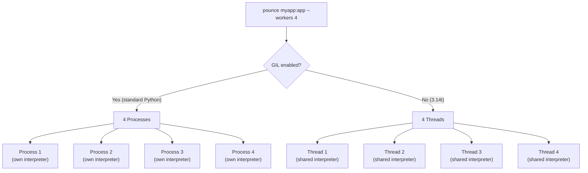

# Pounce — Thread-Based ASGI Workers on Free-Threaded Python

ASGI servers traditionally use process-based workers. Fork the process, load the app in each child, serve requests. Each process has its own interpreter and memory. It works, but it's expensive — N processes means N copies of your app in memory, and any shared state requires IPC.

Free-threaded Python changes the calculus. Threads share memory and can run Python in parallel. One interpreter, N event loops, shared app instance. No fork overhead, no IPC, lower memory. But sharing state between worker threads requires care.

Pounce makes the choice for you: it detects the runtime and picks the right worker model automatically.

---

:::{tip} Series context
This is **Part 5 of 6** in *Free-Threading in the Bengal Ecosystem*. Pounce is the ASGI server — it runs [Chirp](/blog/posts/chirp-free-threading-web-framework/) apps in production, serving pages built with [Kida](/blog/posts/kida-free-threading-template-engine/), [Patitas](/blog/posts/patitas-free-threading-markdown-parser/), and [Rosettes](/blog/posts/rosettes-free-threading-syntax-highlighter/).
:::

---

## Run it with free-threaded Python

```bash
uv python install 3.14t
uv run --python=3.14t pounce myapp:app --workers 4
```

On Python 3.14t, workers are threads — one process, four threads, each with its own asyncio event loop. On standard Python, workers are processes. Same command, same config. The supervisor detects the runtime and adapts.

---

## Threads vs processes — one runtime, two modes

This is the key decision. Pounce detects the GIL at startup and picks the worker model:

```python
def is_gil_enabled() -> bool:
    return getattr(sys, "_is_gil_enabled", lambda: True)()

def detect_worker_mode() -> WorkerMode:
    return "process" if is_gil_enabled() else "thread"
```

The supervisor uses it:

```python
if self._mode == "thread":
    target = threading.Thread(
        target=worker.run, name=f"pounce-worker-{worker_id}", daemon=True
    )
else:
    target = multiprocessing.Process(
        target=worker.run, name=f"pounce-worker-{worker_id}", daemon=True
    )
target.start()
```

Same `Worker` class, same `ServerConfig`, same request flow. Only the spawning mechanism differs.



:::{tab-set}
:::{tab-item} Thread mode (free-threaded)
- One process, shared memory
- One copy of the app loaded
- Lower RSS (~60–80 MB for 4 workers)
- No IPC needed for shared state
- Graceful rolling restart available
:::
:::{tab-item} Process mode (GIL)
- N processes, isolated memory
- App loaded N times
- Higher RSS (~100–150 MB for 4 workers)
- IPC needed for any shared state
- Brief-downtime restart only
:::
:::

---

## Shared immutable config

Workers need config: host, port, timeouts, limits, compression settings. Mutating a shared dict from multiple threads is a race. Pounce uses a frozen dataclass:

```python
@dataclass(frozen=True, slots=True)
class ServerConfig:
    """Immutable server configuration.
    Created once at startup, shared across all worker threads.
    """
    host: str = "127.0.0.1"
    port: int = 8000
    workers: int = 1
    keep_alive_timeout: float = 5.0
    request_timeout: float = 30.0
    compression: bool = True
    # ... 30+ fields, all immutable
```

Created once at startup, passed to every worker. No one mutates it. No locks.

---

## Per-request compressors — no shared state

Compression (gzip, zstd) requires stateful compressors. Sharing one compressor across requests would be a race. Pounce creates a fresh compressor per request:

```python
class GzipCompressor:
    """Creates a fresh zlib compressor per instance.
    Each request gets its own — no shared state.
    """
    def __init__(self, *, level: int = 6) -> None:
        self._compressor = zlib.compressobj(level, zlib.DEFLATED, 31)
```

The cost of creating a compressor is small compared to the request lifetime. The alternative — locking around a shared compressor — would serialize the compression phase across all workers.

---

## The Brotli exclusion

:::{warning} C Extension Gotcha
Pounce supports zstd (stdlib, PEP 784) and gzip (stdlib zlib). Brotli is intentionally excluded — the `brotli` C extension re-enables the GIL on Python 3.14t.

Using it in a free-threaded server would serialize all worker threads whenever *any* thread compresses a response. Clients that send only `Accept-Encoding: br` receive uncompressed responses.
:::

This is a real-world lesson for the free-threading ecosystem: **audit your C extensions.** Some re-enable the GIL silently. Prefer stdlib or verified free-threading-safe libraries.

---

## Lock only where it matters

Most of Pounce's request path is lock-free — config reads, compressor creation, ASGI dispatch. But connection IDs must be unique and monotonic:

```python
_id_counter = 0
_id_lock = threading.Lock()

def next_connection_id() -> int:
    global _id_counter
    with _id_lock:
        _id_counter += 1
        return _id_counter
```

A lock around the increment is correct and cheap. The pattern: identify the minimal set of shared mutable state, lock only that, leave everything else immutable or per-request.

---

## Frozen lifecycle events

Observability events are frozen dataclasses — safe to pass across thread boundaries, buffer, or log:

```python
@dataclass(frozen=True, slots=True)
class ConnectionOpened:
    connection_id: int
    worker_id: int
    client_addr: str
    client_port: int
    protocol: str
    timestamp_ns: int

@dataclass(frozen=True, slots=True)
class ResponseCompleted:
    connection_id: int
    worker_id: int
    status: int
    bytes_sent: int
    duration_ms: float
    timestamp_ns: int
```

Workers produce events; an optional `LifecycleCollector` consumes them. No defensive copying. No locks on the event objects themselves.

---

## Graceful reload — a thread-mode benefit

In thread mode, Pounce supports zero-downtime rolling restart:

1. Spawn new workers
2. Mark old workers for draining (finish existing connections, reject new)
3. Wait for old workers to become idle
4. Shut down old workers

This works because threads share memory — the supervisor can signal workers directly. In process mode, workers run in separate address spaces, so Pounce falls back to brief-downtime restart. Graceful reload is a concrete benefit of the thread-based model.

---

## What this means in practice

On free-threaded Python 3.14t, `pounce myapp:app --workers 4` runs four threads sharing one interpreter. One app load. Shared immutable config. No fork, no IPC. Compression uses stdlib only — no GIL-reenabling extensions.

On standard Python, the same command runs four processes. Same behavior, higher memory, no rolling restart. You upgrade to free-threaded Python and get the thread-mode benefits without changing your deployment config.

Pounce serves [Chirp](/blog/posts/chirp-free-threading-web-framework/) apps — the web framework layer in the Bengal ecosystem.

---

## Further reading

- [Python experimental support for free threading](https://docs.python.org/3/howto/free-threading-python.html)
- [Pounce documentation](https://lbliii.github.io/pounce/)
- [Pounce source](https://github.com/lbliii/pounce)
- **Next in series:** [Chirp — A Web Framework Built for Free-Threaded Python](/blog/posts/chirp-free-threading-web-framework/)
