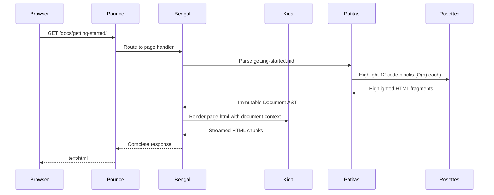
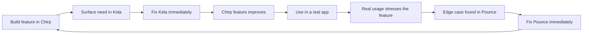

# The Vertical Stack Thesis — Why I Build Every Layer

People ask why I wrote my own template engine, my own markdown parser, my own syntax highlighter, my own ASGI server, my own web framework, and my own static site generator. There are existing options for every one of those. The question is fair.

The answer isn't "because I can." It's because the stack is the product, and the product only works if the pieces fit.

---

## The problem with assembled stacks

Most Python web projects are assembled from parts that don't know about each other. Flask doesn't know about Jinja2's internals. Jinja2 doesn't know about Pygments. Uvicorn doesn't know about your framework's concurrency model. You glue them together with configuration, hope the abstractions don't leak, and accept the friction when they do.

That friction compounds. A template engine designed for single-threaded Django can't give you lock-free rendering. A markdown parser that shells out to Pygments for highlighting can't give you O(n) guarantees. An ASGI server that forks processes can't share immutable config across workers. Each layer's design constraints leak into the layers above.

When you own the vertical stack, you don't inherit those constraints. You design each layer knowing exactly what the layers above and below need.

---

## The dependency graph

```mermaid
flowchart TB
    Purr["Purr — Content-Reactive Runtime"]

    Bengal["Bengal — Static Site Generator"]
    Chirp["Chirp — Web Framework"]
    ChirpUI["Chirp UI — Component Library"]

    Kida["Kida — Template Engine"]
    Patitas["Patitas — Markdown Parser"]
    Pounce["Pounce — ASGI Server"]
    Rosettes["Rosettes — Syntax Highlighter"]
    Zoomies["Zoomies — QUIC / HTTP/3"]

    Purr --> Bengal
    Purr --> Chirp
    Purr --> ChirpUI

    Bengal --> Kida
    Bengal --> Patitas
    Chirp --> Kida
    Chirp --> Pounce
    ChirpUI --> Kida
    Patitas --> Rosettes
    Pounce -.-> Zoomies

    style Kida fill:#2d4a2d,stroke:#4a7a4a
    style Patitas fill:#2d4a2d,stroke:#4a7a4a
    style Rosettes fill:#2d4a2d,stroke:#4a7a4a
    style Pounce fill:#2d4a2d,stroke:#4a7a4a
    style Zoomies fill:#2d4a2d,stroke:#4a7a4a
```



The foundation — Kida, Patitas, Rosettes, Pounce, Zoomies — has almost no external dependencies. Kida and Rosettes are pure Python with zero third-party imports. Patitas depends only on PyYAML. Zoomies depends only on `cryptography`. The entire foundation layer pulls in two external packages.

That's not accidental. External dependencies are design constraints you can't control. Minimizing them at the foundation means the stack's behavior is predictable from bottom to top.

---

## How the layers multiply value

The real payoff of vertical ownership isn't that each library works well alone. It's that each layer unlocks capabilities in the layers above that wouldn't be possible with independent parts.

### Rosettes → Patitas: O(n) highlighting inside the parser

Most markdown parsers delegate syntax highlighting to Pygments, which uses regex-based lexers. Pygments is powerful but regex has fundamental problems: catastrophic backtracking, ReDoS vulnerabilities, and unpredictable worst-case performance.

Rosettes uses hand-written state machines instead. Every lexer is O(n) — linear in the input, no backtracking, no ReDoS. Because Patitas owns the integration with Rosettes, highlighting happens *inside* the parse step, not as a post-processing shell-out:

```python
from patitas import render

html = render("""
```python
def fibonacci(n: int) -> int:
    a, b = 0, 1
    for _ in range(n):
        a, b = b, a + b
    return a
``‍`
""")
```

That single call parses the markdown, identifies the fenced code block, highlights it with Rosettes' O(n) Python lexer, and returns HTML. No subprocess. No regex engine. No second pass. Patitas knows Rosettes' API because they're designed together.

When Bengal builds 250 pages of documentation — many of them heavy with code samples — every code block gets O(n) highlighting with no ReDoS risk. That guarantee flows up from Rosettes through Patitas into Bengal without any configuration.

### Patitas → Bengal: Immutable AST enables parallel parsing

Patitas returns an immutable document AST:

```python
@dataclass(frozen=True, slots=True)
class Document:
    children: tuple[Node, ...]
    metadata: Metadata
```

Because the AST is frozen, Bengal can parse hundreds of markdown files in parallel on free-threaded Python. Each worker thread gets its own lexer and parser — no shared mutable state between parses:

```python
with ThreadPoolExecutor(max_workers=workers) as pool:
    futures = {
        pool.submit(ctx.run, parse_page, page): page
        for page in pages
    }
```

If Patitas returned mutable trees, Bengal would need locks around every parse. If Patitas shared state between parses, parallel execution would be unsafe. The immutability decision in Patitas *enables* the parallelism in Bengal. That's not a feature you can bolt on with an adapter — it has to be in the design.

### Kida → Chirp: Block rendering enables type-driven fragments

Kida compiles templates to Python AST and supports rendering individual named blocks — not just full templates. This is what makes Chirp's `Fragment` and `Page` return types possible:

```python
# Chirp route handler — return a type, not a response
@app.route("/tasks", methods=["POST"])
def create_task(request: Request):
    task = store.add(request.form["title"])
    return Fragment("tasks.html", "task_item", task=task)
```

Under the hood, Chirp asks Kida to render just the `task_item` block from `tasks.html`:

```python
# Inside Chirp's negotiator
def render_fragment(env: Environment, frag: Fragment) -> str:
    tmpl = env.get_template(frag.template_name)
    return tmpl.render_block(frag.block_name, frag.context)
```

Jinja2 doesn't expose `render_block()` as a first-class API. You can hack it with `` extraction, but it's not designed for it. Kida has `render_block()` because Chirp needs it. Chirp has `Fragment` because Kida supports it. The feature exists *between* the layers, not in either one alone.

### Kida → Bengal: Streaming templates for progressive rendering

Kida's `render_stream()` yields HTML in chunks as template blocks resolve. Bengal uses this for progressive page rendering — the page header and navigation render immediately while heavy content blocks (like large code samples or image galleries) stream in:

```python
tmpl = env.get_template("page.html")
for chunk in tmpl.render_stream(page_context):
    output.write(chunk)
```

Chirp uses the same capability differently — `Stream()` resolves async context values concurrently and streams the HTML as sections become ready:

```python
@app.route("/dashboard")
async def dashboard():
    return Stream("dashboard.html",
        metrics=fetch_metrics(),    # async — resolves concurrently
        activity=fetch_activity(),  # async — resolves concurrently
        title="Dashboard",          # sync — available immediately
    )
```

One template engine feature. Two consumers using it for different purposes. The API was shaped by both needs because both consumers are in the same ecosystem.

### Pounce → Chirp: Thread-based workers with shared config

Pounce runs ASGI workers as threads, not processes. On free-threaded Python, this means real parallelism with shared memory — all workers see the same immutable application config without IPC:

```python
# Pounce spawns thread workers sharing the app
for _ in range(workers):
    thread = threading.Thread(target=worker_loop, args=(app, config))
    thread.start()
```

Chirp exploits this by freezing its entire configuration at startup. The `App` object is mutable during setup — you add routes, register middleware, configure templates. When `app.run()` is called, everything freezes. The compiled route trie, the middleware stack, the template environment — all immutable, all shared across Pounce's worker threads:

```python
app = App(config=AppConfig(template_dir="templates"))

@app.route("/")
def index():
    return Page("index.html", "content", title="Home")

# After this call, app is frozen. Pounce threads share it safely.
app.run()
```

Uvicorn would fork this into separate processes, each with its own copy of the app in memory. Pounce shares one copy across N threads. The memory savings scale linearly with worker count, and there's zero IPC overhead for config access.

### The full vertical: one request through every layer

Here's what happens when a browser requests a documentation page from a Bengal site served by Pounce in dev mode:



Six libraries. One request. No configuration glue, no adapter layers, no impedance mismatches. Each library knows the contract of the library below it because they were designed together.

---

## The flywheel

Owning the stack creates a development cycle that doesn't exist when you're a consumer of someone else's libraries:



No upstream PRs. No waiting for a maintainer who might not share your priorities. No workarounds. When I hit a limitation in any layer, I fix it at the source — usually in the same session.

This isn't faster than using established libraries for the first feature. It's faster for the hundredth. Every cycle tightens every layer. The APIs evolve based on actual usage across multiple consumers, not hypothetical use cases in an issue tracker.

---

## The ecosystem is the test suite

Bengal's 250-page documentation site is a more rigorous test of Kida than any unit test battery. It exercises template inheritance, block rendering, streaming, filters, and caching across hundreds of real pages with real content.

Chirp's 32 example applications — from a 31-line GET form to a 507-line kanban board — exercise content negotiation, SSE streaming, OOB swaps, file-based routing, form validation, and session auth. Internal applications built on the stack add dependency injection, contract checks, and LLM streaming on top.

Patitas parses every markdown file across every docs site. Rosettes highlights every code block. Pounce serves every dev server and every ASGI application.

:::{list-table} Cross-layer validation
:header-rows: 1

- - Foundation
  - Consumers
  - Pages / Routes Exercised
- - Kida
  - Bengal, Chirp, Chirp UI
  - ~520 docs pages + 32 examples + production apps
- - Patitas
  - Bengal
  - ~520 markdown files across 8 docs sites
- - Rosettes
  - Patitas → Bengal
  - Every fenced code block in every docs site
- - Pounce
  - Bengal dev server, Chirp apps
  - All ASGI serving across the stack
:::

Each layer above is a demanding, real-world consumer of the layers below. Bugs found this way are real bugs — not synthetic test cases.

---

## What this requires

Honesty. Owning the stack means you can't blame upstream. If Kida has a performance problem, it's your problem. If Pounce drops connections under load, it's your problem. If Patitas misparses a CommonMark edge case, it's your problem.

You also can't hide behind adoption metrics. Nobody else is filing issues. The quality bar is set by you, for you, against real applications. That's a different kind of accountability than "it has 10,000 stars so it must be good."

:::{warning}
Vertical ownership is not the right choice for most projects. It trades breadth of community testing for depth of integrated testing. It makes sense when the layers need to share design assumptions — like free-threading safety — that upstream libraries don't provide. It doesn't make sense when existing tools genuinely solve the problem and the integration friction is low.
:::

---

## The thesis

The web development ecosystem is bloated. A simple Python web application shouldn't require a template engine that doesn't know about your concurrency model, a markdown parser that shells out to a regex-based highlighter, and an ASGI server that forks processes because it was designed before `nogil` existed.

The b-stack thesis is that a vertically integrated, pure-Python stack — designed for free-threaded Python, with each layer aware of the layers above and below — can be leaner, clearer, and faster than an assembled stack of uncoordinated parts.

This blog is built with it. The docs sites are built with it. The proof isn't a benchmark. It's the work.

---

## Further reading

- [Part 1: Bengal — Free-Threading Architecture](/blog/posts/bengal-free-threading-architecture/)
- [Part 2: Kida — Thread-Safe Template Engine](/blog/posts/kida-free-threading-template-engine/)
- [Part 3: Patitas — Parallel Markdown Parsing](/blog/posts/patitas-free-threading-markdown-parser/)
- [Part 4: Rosettes — Immutable Syntax Highlighting](/blog/posts/rosettes-free-threading-syntax-highlighting/)
- [Part 5: Pounce — Thread-Based ASGI Workers](/blog/posts/pounce-free-threading-asgi-server/)
- [Part 6: Chirp — Free-Threaded Web Framework](/blog/posts/chirp-free-threading-web-framework/)
